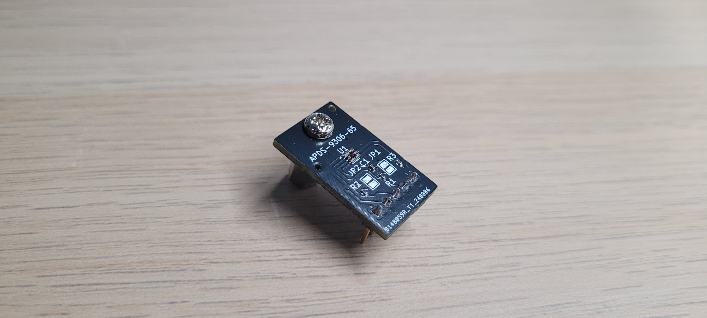
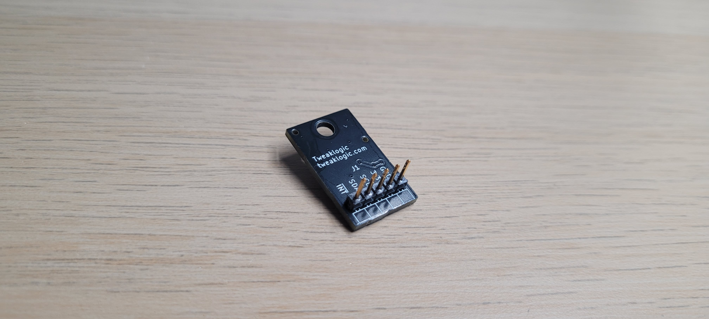
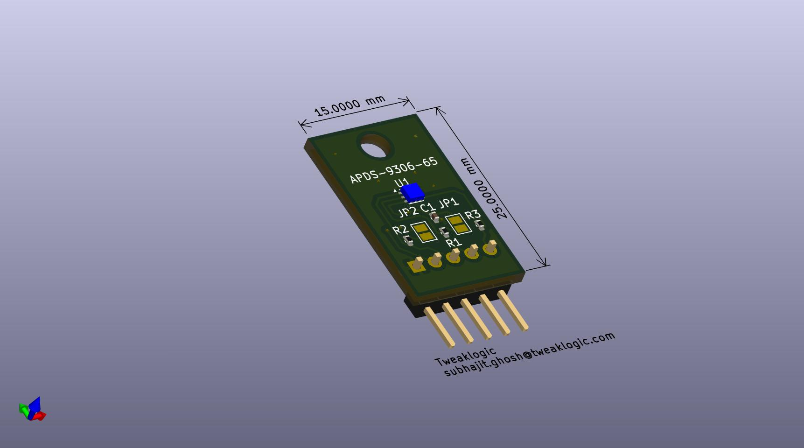

## Avago (Broadcom) APDS9306-65 Ambient Light Sensor

### Linux Kernel driver
- A Linux kernel driver for APDS9306 is available from kernel version 6.10 onwards.
- A backport of the driver for older kernel versions can be found [here](https://github.com/tweaklogic/apds9306_backport).

### LICENSE
Please refer to [LICENSE](https://github.com/tweaklogic/apds9306-65_breakout-board/blob/main/LICENSE) file in this repo.